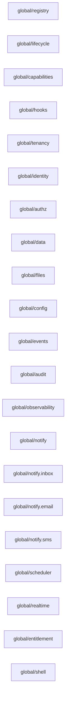

# seam 图

由 `qian docs generate` 派生；profile：` platform `。请修改输入后重新生成。

由清单 inject/provides 派生；同 scope 优先，其次 global。骨架的空键集合不代表未来没有依赖。

| 服务键 | Provider 条目 | Consumer 条目 |
|---|---|---|

```mermaid
flowchart LR
  n0["global/registry"]
  n1["global/lifecycle"]
  n2["global/capabilities"]
  n3["global/hooks"]
  n4["global/tenancy"]
  n5["global/identity"]
  n6["global/authz"]
  n7["global/data"]
  n8["global/files"]
  n9["global/config"]
  n10["global/events"]
  n11["global/audit"]
  n12["global/observability"]
  n13["global/notify"]
  n14["global/notify.inbox"]
  n15["global/notify.email"]
  n16["global/notify.sms"]
  n17["global/scheduler"]
  n18["global/realtime"]
  n19["global/entitlement"]
  n20["global/shell"]
```

